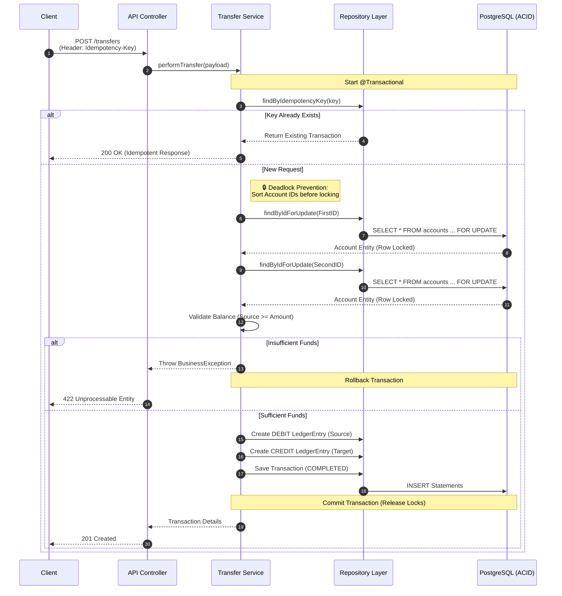

# 💳 Fintech Ledger Simulator


## 📖 Introduction

A high-performance, **Double-Entry Bookkeeping** backend service designed to handle atomic financial transactions with high integrity and auditability.

In modern fintech environments, data integrity is non-negotiable. This service simulates a core banking ledger where money is never simply "updated" in a column, but moved through immutable transaction logs. It is designed to be resilient against race conditions, network failures, and double-spending attacks.

---

## 📦 Implementation Progress

| Phase | Status | Description |
|-------|--------|-------------|
| 1. Project Setup | ✅ Complete | Maven, dependencies, application config |
| 2. Infrastructure | ✅ Complete | Docker, PostgreSQL, Flyway migrations |
| 3. Domain Entities | ✅ Complete | Enums, JPA entities (Account, Transaction, LedgerEntry) |
| 4. DTOs & Mappers | ✅ Complete | Request/Response DTOs, MapStruct mappers |
| 5. Repositories | ✅ Complete | Data access layer with cursor-based pagination, optimized balance reads |
| 6. Services | ✅ Complete | AccountService, TransferService, LedgerService with exception handling |
| 7. Controllers | ✅ Complete | REST API endpoints with OpenAPI/Swagger documentation |
| 8. Exception Handling | ⏳ Pending | Global exception handler |
| 9-11. Tests | ⏳ Pending | Unit, integration, concurrency tests |
| 12-13. DevOps & Docs | ⏳ Pending | CI/CD, documentation |

---

## 🛠 Tech Stack

| Technology | Version | Purpose |
|------------|---------|---------|
| Java | 21+ | Language (Records, Pattern Matching) |
| Spring Boot | 3.2.2 | Framework |
| PostgreSQL | 16 | Database |
| Spring Data JPA | - | ORM/Persistence |
| Hibernate | - | JPA Implementation |
| Flyway | - | Database Migrations |
| Jakarta Validation | - | Bean Validation |
| MapStruct | 1.5.5.Final | Entity↔DTO Mapping |
| SpringDoc OpenAPI | 2.3.0 | API Documentation (Swagger UI) |
| JUnit 5 | - | Unit Testing |
| Testcontainers | - | Integration Testing |
| AssertJ | - | Fluent Assertions |
| Mockito | - | Mocking |

---

## 🏗 Architecture & Design Patterns

### Double-Entry Bookkeeping

Instead of a simple `balance` column update, every transfer generates two `LedgerEntry` records:
1. **Debit** from the Sender (money out)
2. **Credit** to the Receiver (money in)

The balance is calculated as: `SUM(credits) - SUM(debits)`

### Domain Model

```
Account
├── id: UUID (PK)
├── document: String (unique, indexed)
├── name: String
├── createdAt: Instant
└── updatedAt: Instant

Transaction
├── id: UUID (PK)
├── idempotencyKey: String (unique, indexed)
├── sourceAccountId: UUID (FK)
├── targetAccountId: UUID (FK)
├── amount: BigDecimal(19,2)
├── status: TransactionStatus (PENDING/COMPLETED/FAILED)
└── createdAt: Instant

LedgerEntry
├── id: UUID (PK)
├── transactionId: UUID (FK)
├── accountId: UUID (FK)
├── entryType: EntryType (DEBIT/CREDIT)
├── amount: BigDecimal(19,2)
├── balanceAfter: BigDecimal(19,2)
└── createdAt: Instant
```

### Concurrency Strategy: Pessimistic Locking

To prevent race conditions where two threads try to spend the same balance simultaneously, we use `SELECT ... FOR UPDATE` (Pessimistic Write Lock) on the account rows during the transaction window.

```java
@Lock(LockModeType.PESSIMISTIC_WRITE)
@Query("SELECT a FROM Account a WHERE a.id = :id")
Optional<Account> findByIdForUpdate(@Param("id") UUID id);
```

### Deadlock Prevention

Account IDs are **sorted before locking** to ensure consistent lock ordering:

```java
UUID firstId = sourceId.compareTo(targetId) < 0 ? sourceId : targetId;
UUID secondId = sourceId.compareTo(targetId) < 0 ? targetId : sourceId;
```

---

## 🎯 Requirements Specification

### Functional Requirements (FR)

| ID | Requirement | Status |
|----|-------------|--------|
| FR-01 | Create Account - Create financial account associated with a user | ⏳ |
| FR-02 | Money Transfer - Atomic P2P transfers (both succeed or fail) | ⏳ |
| FR-03 | Balance Retrieval - Real-time calculated balance | ⏳ |
| FR-04 | Transaction History - Ledger statement with timestamps | ⏳ |
| FR-05 | Idempotency - Unique `Idempotency-Key` header support | ⏳ |

### Non-Functional Requirements (NFR)

| ID | Requirement | Status |
|----|-------------|--------|
| NFR-01 | ACID compliance using PostgreSQL | ✅ |
| NFR-02 | Pessimistic locking for concurrency control | ✅ |
| NFR-03 | Immutable append-only ledger | ✅ |
| NFR-04 | BigDecimal for monetary precision | ✅ |
| NFR-05 | RFC 7807 error responses | ⏳ |

### Business Rules (BR)

| ID | Rule | Status |
|----|------|--------|
| BR-01 | Conservation of Value - Debits = Credits | ✅ |
| BR-02 | No Overdraft - Balance cannot go negative | ✅ |

---

## 🚦 API Endpoints

| Method | Endpoint | Description | Request Body |
|--------|----------|-------------|--------------|
| POST | `/api/v1/accounts` | Create new account | `{ "document": "123", "name": "John" }` |
| GET | `/api/v1/accounts/{id}` | Get account & balance | - |
| GET | `/api/v1/accounts` | List accounts (paginated) | - |
| POST | `/api/v1/transfers` | Execute atomic transfer | `{ "sourceAccountId": "...", "targetAccountId": "...", "amount": 100.00 }` |
| GET | `/api/v1/transfers/{id}` | Get transfer details | - |
| GET | `/api/v1/ledger/{accountId}` | Get account statement | - |

### Headers

| Header | Required | Description |
|--------|----------|-------------|
| `Idempotency-Key` | Yes (POST) | Unique key to prevent duplicate processing |

---

## 🏃 How to Run

### Prerequisites

- Java 21+
- Docker & Docker Compose
- Maven 3.9+

### Quick Start

1. **Clone the repository:**
   ```bash
   git clone https://github.com/your-username/fintech-ledger-simulator.git
   cd fintech-ledger-simulator
   ```

2. **Configure environment:**
   ```bash
   cp .env.example .env
   # Edit .env if needed
   ```

3. **Start PostgreSQL:**
   ```bash
   docker-compose up -d
   ```

4. **Run the application:**
   ```bash
   ./mvnw spring-boot:run -Dspring-boot.run.profiles=dev
   ```

5. **Access the API:**
   - Application: http://localhost:8080
   - Swagger UI: http://localhost:8080/swagger-ui.html (when implemented)

### Running Tests

```bash
# Unit tests
./mvnw test

# Integration tests (requires Docker)
./mvnw verify -P integration-tests
```

---

## 📁 Project Structure

```
src/main/java/com/fintech/ledger/
├── LedgerSimulatorApplication.java  # Main application class
├── config/                          # Spring configuration
├── controller/                      # REST controllers
├── service/                         # Business logic
├── repository/                      # Data access layer
├── domain/
│   ├── entity/                      # JPA entities
│   │   ├── Account.java
│   │   ├── Transaction.java
│   │   ├── LedgerEntry.java
│   │   ├── EntryType.java           # DEBIT/CREDIT enum
│   │   └── TransactionStatus.java   # PENDING/COMPLETED/FAILED enum
│   └── dto/                         # Request/Response DTOs
├── exception/                       # Custom exceptions & handlers
├── mapper/                          # Entity <-> DTO mappers
└── validation/                      # Custom validators

src/main/resources/
├── application.yml                  # Base configuration
├── application-dev.yml              # Development profile
├── application-test.yml             # Test profile
├── banner.txt                       # Custom startup banner
└── db/migration/                    # Flyway migrations
    ├── V1__create_accounts_table.sql
    ├── V2__create_transactions_table.sql
    └── V3__create_ledger_entries_table.sql
```

---

## 🧪 Testing Strategy

This project follows the **Testing Pyramid** approach:

| Type | Description | Tools |
|------|-------------|-------|
| Unit Tests | Domain logic validation | JUnit 5, Mockito, AssertJ |
| Integration Tests | Repository & controller tests | Testcontainers, @DataJpaTest |
| Concurrency Tests | 100+ thread stress tests | ExecutorService, CountDownLatch |

---

## 📊 Transaction Flow Diagram



---

## 💡 Roadmap & Extensions

- [x] DTOs and MapStruct mappers (Phase 4)
- [x] Repositories with optimized balance queries (Phase 5)
- [x] Services with idempotency and deadlock prevention (Phase 6)
- [ ] REST Controllers (Phase 7)
- [ ] Global exception handling (Phase 8)
- [ ] Full test coverage (Phases 9-11)
- [ ] Dockerization and CI/CD Pipeline (GitHub Actions)
- [ ] Integration with a Mock Central Bank API
- [ ] Implementation of Spring Security (OAuth2/JWT)
- [ ] Prometheus & Grafana metrics for transaction throughput
- [ ] Rate limiting and circuit breakers

---

## 📄 License

This project is licensed under the MIT License.
