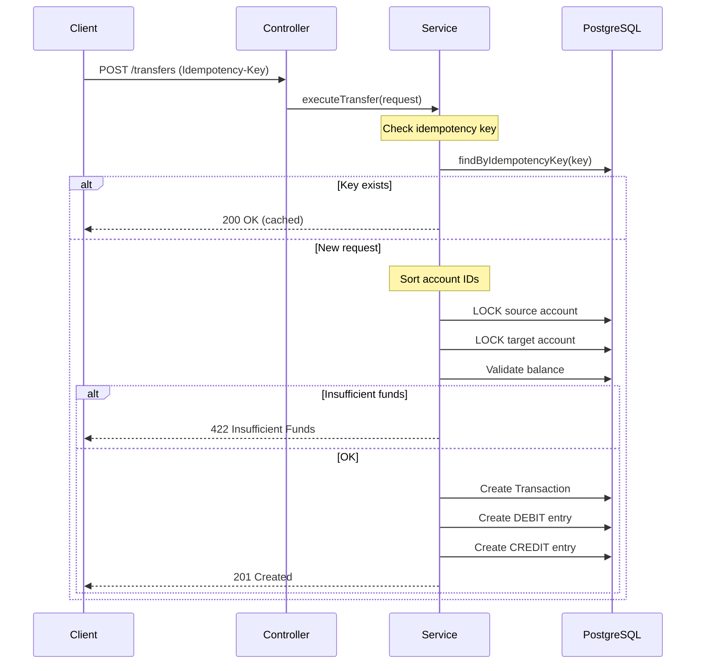

# 💳 Fintech Ledger Simulator


## 📖 Introduction

A high-performance, **Double-Entry Bookkeeping** backend service designed to handle atomic financial transactions with high integrity and auditability.

In modern fintech environments, data integrity is non-negotiable. This service simulates a core banking ledger where money is never simply "updated" in a column, but moved through immutable transaction logs. It is designed to be resilient against race conditions, network failures, and double-spending attacks.

### Key Features

- ✅ **Double-Entry Bookkeeping** - Every transfer creates balanced DEBIT/CREDIT entries
- ✅ **Atomic Transactions** - All-or-nothing operations with pessimistic locking
- ✅ **Idempotency** - Duplicate request protection via `Idempotency-Key` header
- ✅ **Deadlock Prevention** - Sorted lock acquisition order
- ✅ **Comprehensive Testing** - 100+ tests including concurrency stress tests
- ✅ **Production Ready** - Docker, CI/CD, health checks, and monitoring

---

## 📦 Implementation Progress

| Phase | Status | Description |
|-------|--------|-------------|
| 1. Project Setup | ✅ Complete | Maven, dependencies, application config |
| 2. Infrastructure | ✅ Complete | Docker, PostgreSQL, Flyway migrations |
| 3. Domain Entities | ✅ Complete | Enums, JPA entities (Account, Transaction, LedgerEntry) |
| 4. DTOs & Mappers | ✅ Complete | Request/Response DTOs, MapStruct mappers |
| 5. Repositories | ✅ Complete | Data access layer with cursor-based pagination, optimized balance reads |
| 6. Services | ✅ Complete | AccountService, TransferService, LedgerService with exception handling |
| 7. Controllers | ✅ Complete | REST API endpoints with OpenAPI/Swagger documentation |
| 8. Exception Handling | ✅ Complete | Global exception handler with RFC 7807 Problem Details |
| 9. Unit Tests | ✅ Complete | 74 unit tests covering domain, services, mappers, validation |
| 10. Integration Tests | ✅ Complete | Repository and controller integration tests with Testcontainers |
| 11. Concurrency Tests | ✅ Complete | 10 concurrency tests (withdrawal, transfer, stress) |
| 12. DevOps & CI/CD | ✅ Complete | Dockerfile, docker-compose.prod.yml, GitHub Actions CI pipeline |
| 13. Documentation | ✅ Complete | API documentation, README, curl examples, troubleshooting |
| 14. Frontend Setup | ⬜ Planned | Vite + React + TypeScript + shadcn/ui scaffold |
| 15. Admin Panel | ⬜ Planned | General Ledger Data Grid, System Health, Balance Integrity |
| 16. User Simulator | ⬜ Planned | Wallet Card, Transfer Form, Transaction Stream |
| 17. Frontend CI/CD | ⬜ Planned | GitHub Pages deployment, Vitest, deploy workflow |

---

## 🛠 Tech Stack

### Backend

| Technology | Version | Purpose |
|------------|---------|---------|
| Java | 21+ | Language (Records, Pattern Matching) |
| Spring Boot | 3.2.2 | Framework |
| PostgreSQL | 16 | Database |
| Spring Data JPA | - | ORM/Persistence |
| Hibernate | - | JPA Implementation |
| Flyway | - | Database Migrations |
| Jakarta Validation | - | Bean Validation |
| MapStruct | 1.5.5.Final | Entity↔DTO Mapping |
| SpringDoc OpenAPI | 2.3.0 | API Documentation (Swagger UI) |
| JUnit 5 | - | Unit Testing |
| Testcontainers | 1.20.4 | Integration Testing |
| AssertJ | - | Fluent Assertions |
| Mockito | - | Mocking |
| JaCoCo | 0.8.11 | Code Coverage |

### Frontend

| Technology | Version | Purpose |
|------------|---------|---------|
| React | 18 | UI Framework |
| Vite | 5+ | Build Tooling (ESBuild HMR) |
| TypeScript | 5+ | Type Safety |
| shadcn/ui | latest | Component Library (Radix + Tailwind) |
| Tailwind CSS | 4 | Utility-first Styling |
| TanStack Query | 5 | Server-state Management |
| @tanstack/react-table | 8+ | Headless Data Grid |
| Recharts | 2+ | Data Visualizations |
| React Router | 6+ | Client-side Routing (HashRouter) |
| Vitest | latest | Frontend Unit Testing |

---

## 🚦 API Endpoints

### Base URL

```
http://localhost:8080/api/v1
```

### Swagger UI

Interactive API documentation is available at:
- **Swagger UI**: http://localhost:8080/swagger-ui.html
- **OpenAPI Spec**: http://localhost:8080/v3/api-docs

### Accounts API

| Method | Endpoint | Description |
|--------|----------|-------------|
| POST | `/api/v1/accounts` | Create new account |
| GET | `/api/v1/accounts/{id}` | Get account by ID with balance |
| GET | `/api/v1/accounts` | List all accounts (paginated) |

### Transfers API

| Method | Endpoint | Description | Required Headers |
|--------|----------|-------------|------------------|
| POST | `/api/v1/transfers` | Execute atomic transfer | `Idempotency-Key` |
| GET | `/api/v1/transfers/{id}` | Get transfer details | - |

### Ledger API

| Method | Endpoint | Description |
|--------|----------|-------------|
| GET | `/api/v1/ledger/{accountId}` | Get account statement (paginated) |

### Health Check

| Method | Endpoint | Description |
|--------|----------|-------------|
| GET | `/actuator/health` | Application health status |

---

## 📝 API Examples

### Create Account

**Request:**
```bash
curl -X POST http://localhost:8080/api/v1/accounts \
  -H "Content-Type: application/json" \
  -d '{
    "document": "12345678901",
    "name": "John Doe"
  }'
```

**Response (201 Created):**
```json
{
  "id": "550e8400-e29b-41d4-a716-446655440000",
  "document": "12345678901",
  "name": "John Doe",
  "balance": 0.00,
  "createdAt": "2026-02-06T15:30:00Z"
}
```

### Get Account

**Request:**
```bash
curl -X GET http://localhost:8080/api/v1/accounts/550e8400-e29b-41d4-a716-446655440000
```

**Response (200 OK):**
```json
{
  "id": "550e8400-e29b-41d4-a716-446655440000",
  "document": "12345678901",
  "name": "John Doe",
  "balance": 1500.00,
  "createdAt": "2026-02-06T15:30:00Z"
}
```

### List Accounts (Paginated)

**Request:**
```bash
curl -X GET "http://localhost:8080/api/v1/accounts?page=0&size=20&sort=createdAt,desc"
```

**Response (200 OK):**
```json
{
  "content": [
    {
      "id": "550e8400-e29b-41d4-a716-446655440000",
      "document": "12345678901",
      "name": "John Doe",
      "balance": 1500.00,
      "createdAt": "2026-02-06T15:30:00Z"
    }
  ],
  "pageable": {
    "pageNumber": 0,
    "pageSize": 20
  },
  "totalElements": 1,
  "totalPages": 1
}
```

### Execute Transfer

**Request:**
```bash
curl -X POST http://localhost:8080/api/v1/transfers \
  -H "Content-Type: application/json" \
  -H "Idempotency-Key: tx-$(uuidgen)" \
  -d '{
    "sourceAccountId": "550e8400-e29b-41d4-a716-446655440000",
    "targetAccountId": "550e8400-e29b-41d4-a716-446655440001",
    "amount": 100.00
  }'
```

**Response (201 Created):**
```json
{
  "transactionId": "660e8400-e29b-41d4-a716-446655440002",
  "sourceAccountId": "550e8400-e29b-41d4-a716-446655440000",
  "targetAccountId": "550e8400-e29b-41d4-a716-446655440001",
  "amount": 100.00,
  "status": "COMPLETED",
  "createdAt": "2026-02-06T16:00:00Z"
}
```

### Get Transfer

**Request:**
```bash
curl -X GET http://localhost:8080/api/v1/transfers/660e8400-e29b-41d4-a716-446655440002
```

**Response (200 OK):**
```json
{
  "transactionId": "660e8400-e29b-41d4-a716-446655440002",
  "sourceAccountId": "550e8400-e29b-41d4-a716-446655440000",
  "targetAccountId": "550e8400-e29b-41d4-a716-446655440001",
  "amount": 100.00,
  "status": "COMPLETED",
  "createdAt": "2026-02-06T16:00:00Z"
}
```

### Get Account Statement

**Request:**
```bash
curl -X GET "http://localhost:8080/api/v1/ledger/550e8400-e29b-41d4-a716-446655440000?page=0&size=50"
```

**Response (200 OK):**
```json
{
  "accountId": "550e8400-e29b-41d4-a716-446655440000",
  "accountName": "John Doe",
  "currentBalance": 1400.00,
  "entries": [
    {
      "id": "770e8400-e29b-41d4-a716-446655440003",
      "transactionId": "660e8400-e29b-41d4-a716-446655440002",
      "entryType": "DEBIT",
      "amount": 100.00,
      "balanceAfter": 1400.00,
      "createdAt": "2026-02-06T16:00:00Z"
    },
    {
      "id": "770e8400-e29b-41d4-a716-446655440004",
      "transactionId": "650e8400-e29b-41d4-a716-446655440001",
      "entryType": "CREDIT",
      "amount": 1500.00,
      "balanceAfter": 1500.00,
      "createdAt": "2026-02-06T15:30:00Z"
    }
  ]
}
```

---

## ❌ Error Responses

All errors follow [RFC 7807 Problem Details](https://datatracker.ietf.org/doc/html/rfc7807) format:

### Validation Error (400)

```json
{
  "type": "/errors/validation-failed",
  "title": "Validation Failed",
  "status": 400,
  "detail": "Request validation failed",
  "instance": "/api/v1/accounts",
  "timestamp": "2026-02-06T16:00:00Z",
  "errors": [
    {
      "field": "document",
      "message": "Document is required"
    }
  ]
}
```

### Not Found (404)

```json
{
  "type": "/errors/account-not-found",
  "title": "Account Not Found",
  "status": 404,
  "detail": "Account with ID 550e8400-e29b-41d4-a716-446655440099 not found",
  "instance": "/api/v1/accounts/550e8400-e29b-41d4-a716-446655440099",
  "timestamp": "2026-02-06T16:00:00Z"
}
```

### Duplicate Document (409)

```json
{
  "type": "/errors/duplicate-document",
  "title": "Duplicate Document",
  "status": 409,
  "detail": "Account with document '12345678901' already exists",
  "instance": "/api/v1/accounts",
  "timestamp": "2026-02-06T16:00:00Z"
}
```

### Insufficient Funds (422)

```json
{
  "type": "/errors/insufficient-funds",
  "title": "Insufficient Funds",
  "status": 422,
  "detail": "Account 550e8400-e29b-41d4-a716-446655440000 has insufficient funds. Available: 50.00, Requested: 100.00",
  "instance": "/api/v1/transfers",
  "timestamp": "2026-02-06T16:00:00Z"
}
```

---

## 🏃 How to Run

### Prerequisites

- Java 21+
- Docker & Docker Compose
- Maven 3.9+

### Quick Start

1. **Clone the repository:**
   ```bash
   git clone https://github.com/your-username/fintech-ledger-simulator.git
   cd fintech-ledger-simulator
   ```

2. **Configure environment:**
   ```bash
   cp .env.example .env
   # Edit .env if needed
   ```

3. **Start PostgreSQL:**
   ```bash
   docker-compose up -d
   ```

4. **Run the application:**
   ```bash
   # Development mode
   ./mvnw spring-boot:run -Dspring-boot.run.profiles=dev
   
   # Or with Maven wrapper (Windows)
   mvnw.cmd spring-boot:run "-Dspring-boot.run.profiles=dev"
   ```

5. **Access the API:**
   - Application: http://localhost:8080
   - Swagger UI: http://localhost:8080/swagger-ui.html
   - Health: http://localhost:8080/actuator/health

### Running Tests

```bash
# Unit tests only
./mvnw test

# Integration tests (requires Docker)
./mvnw verify

# Concurrency tests only
./mvnw failsafe:integration-test -Dit.test=ConcurrentTransferTest

# With coverage report
./mvnw verify jacoco:report
# Report at: target/site/jacoco/index.html
```

### Docker Production

```bash
# Build Docker image
docker build -t fintech-ledger-simulator:latest .

# Run production stack
docker-compose -f docker-compose.prod.yml up -d

# View logs
docker-compose -f docker-compose.prod.yml logs -f app

# Stop
docker-compose -f docker-compose.prod.yml down
```

### Frontend Development

```bash
# Navigate to frontend directory
cd frontend

# Install dependencies
npm install

# Start dev server (http://localhost:5173)
npm run dev

# Run frontend tests
npm test

# Build for production
npm run build
# Output at: frontend/dist/
```

---

## ⚙️ Environment Variables

| Variable | Description | Default |
|----------|-------------|---------|
| `DB_URL` | PostgreSQL JDBC URL | `jdbc:postgresql://localhost:5432/ledger_db` |
| `DB_USERNAME` | Database username | `ledger_user` |
| `DB_PASSWORD` | Database password | `ledger_password` |
| `SERVER_PORT` | Application port | `8080` |
| `SPRING_PROFILES_ACTIVE` | Spring profile | `dev` |

### Docker Environment (`.env`)

```bash
# PostgreSQL Configuration
POSTGRES_DB=ledger_db
POSTGRES_USER=ledger_user
POSTGRES_PASSWORD=ledger_password
POSTGRES_PORT=5432

# Application Configuration
SPRING_PROFILES_ACTIVE=prod
```

---

## 🏗 Architecture

### Domain Model

```
Account
├── id: UUID (PK)
├── document: String (unique, indexed)
├── name: String
├── createdAt: Instant
└── updatedAt: Instant

Transaction
├── id: UUID (PK)
├── idempotencyKey: String (unique, indexed)
├── sourceAccountId: UUID (FK)
├── targetAccountId: UUID (FK)
├── amount: BigDecimal(19,2)
├── status: TransactionStatus (PENDING/COMPLETED/FAILED)
└── createdAt: Instant

LedgerEntry
├── id: UUID (PK)
├── transactionId: UUID (FK)
├── accountId: UUID (FK)
├── entryType: EntryType (DEBIT/CREDIT)
├── amount: BigDecimal(19,2)
├── balanceAfter: BigDecimal(19,2)
└── createdAt: Instant
```

### Double-Entry Bookkeeping

Every transfer creates exactly 2 ledger entries:
1. **DEBIT** from sender (money out)
2. **CREDIT** to receiver (money in)

Balance is calculated as: `SUM(credits) - SUM(debits)`

### Concurrency Strategy

- **Pessimistic Locking**: `SELECT ... FOR UPDATE` on account rows
- **Deadlock Prevention**: Account IDs sorted before locking
- **Lock Timeout**: 5 seconds (configurable)

---

## 📊 Transaction Flow



---

## 🧪 Testing

| Type | Count | Description |
|------|-------|-------------|
| Unit Tests | 74 | Domain/Service/Mapper logic |
| Integration Tests | 27 | Repository/Controller with Testcontainers |
| Concurrency Tests | 10 | 100+ thread stress tests |
| **Total** | **111** | |

### Coverage

- Line coverage: >80%
- Branch coverage: >75%
- Critical paths: 100%

---

## 🔧 Troubleshooting

### Common Issues

#### 1. PostgreSQL Connection Refused

```
Connection refused to host: localhost, port: 5432
```

**Solution:** Ensure PostgreSQL is running:
```bash
docker-compose up -d
docker-compose ps  # Check status
```

#### 2. Flyway Migration Failed

```
Migration checksum mismatch
```

**Solution:** Reset the database (dev only):
```bash
docker-compose down -v
docker-compose up -d
```

#### 3. Tests Fail: Docker Not Found

```
Could not find a valid Docker environment
```

**Solution:** Ensure Docker Desktop is running and accessible.

#### 4. MapStruct Beans Not Found

```
NoSuchBeanDefinitionException: AccountMapper
```

**Solution:** Force recompilation:
```bash
mvn clean install -DskipTests
```

#### 5. Port Already in Use

```
Web server failed to start. Port 8080 was already in use.
```

**Solution:** Use different port or kill existing process:
```bash
# Windows
netstat -ano | findstr :8080
taskkill /PID <PID> /F

# Or use different port
mvn spring-boot:run -Dspring-boot.run.arguments=--server.port=8081
```

#### 6. OutOfMemory During Tests

```
java.lang.OutOfMemoryError: Java heap space
```

**Solution:** Increase Maven heap:
```bash
set MAVEN_OPTS=-Xmx1024m
mvn verify
```

---

## 📁 Project Structure

### Backend

```
src/main/java/com/fintech/ledger/
├── LedgerSimulatorApplication.java  # Main application
├── config/                          # Spring configuration
├── controller/                      # REST controllers
│   ├── AccountController.java
│   ├── TransferController.java
│   └── LedgerController.java
├── service/                         # Business logic
│   ├── AccountService.java
│   ├── TransferService.java
│   └── LedgerService.java
├── repository/                      # Data access layer
├── domain/
│   ├── entity/                      # JPA entities
│   └── dto/                         # Request/Response DTOs
├── exception/                       # Exception handling
├── mapper/                          # MapStruct mappers
└── validation/                      # Custom validators
```

### Frontend

```
frontend/
├── src/
│   ├── main.tsx                     # Entry point
│   ├── App.tsx                      # Root with HashRouter
│   ├── components/ui/               # shadcn/ui components
│   ├── services/
│   │   └── ledgerProvider.ts        # API abstraction layer
│   ├── hooks/                       # TanStack Query hooks
│   ├── pages/
│   │   ├── admin/                   # Admin dashboard pages
│   │   └── user/                    # User wallet pages
│   ├── features/
│   │   ├── admin/                   # Admin components (Grid, Charts)
│   │   └── user/                    # User components (Wallet, Stream)
│   └── types/api.ts                 # TypeScript interfaces
├── vite.config.ts                   # Vite + base path config
├── tailwind.config.ts               # Tailwind CSS v4
└── components.json                  # shadcn/ui config
```

### Configuration

```
src/main/resources/
├── application.yml                  # Base configuration
├── application-dev.yml              # Development profile
├── application-test.yml             # Test profile
├── application-prod.yml             # Production profile
└── db/migration/                    # Flyway migrations
```

---

## 💡 Roadmap

### Backend ✅
- [x] DTOs and MapStruct mappers
- [x] Repositories with optimized balance queries
- [x] Services with idempotency and deadlock prevention
- [x] REST Controllers with OpenAPI documentation
- [x] Global exception handling (RFC 7807)
- [x] Unit tests (74 tests)
- [x] Integration tests with Testcontainers (27 tests)
- [x] Concurrency tests (10 tests)
- [x] Dockerization and CI/CD Pipeline

### Frontend ⬜
- [ ] Vite + React + TypeScript + shadcn/ui project scaffold
- [ ] Admin Panel — General Ledger Data Grid with cursor-based pagination
- [ ] Admin Panel — System Health (TPS/Volume charts) + Balance Integrity Widget
- [ ] User Simulator — Wallet Card with optimistic UI + real-time polling
- [ ] User Simulator — Transfer Form with idempotency + Transaction Stream
- [ ] GitHub Pages deployment with HashRouter + CI/CD workflow
- [ ] Frontend unit tests with Vitest

### Future
- [ ] Integration with Mock Central Bank API
- [ ] Spring Security (OAuth2/JWT)
- [ ] Prometheus & Grafana metrics
- [ ] Rate limiting and circuit breakers
- [ ] Reconciliation interface (MT940, BAI2, CSV ingestion)

---

## 🤝 Contributing

See [CONTRIBUTING.md](CONTRIBUTING.md) for guidelines.

---

## 📄 License

This project is licensed under the MIT License - see [LICENSE](LICENSE) for details.

---

## 📞 Support

- **Issues**: [GitHub Issues](https://github.com/your-username/fintech-ledger-simulator/issues)
- **Documentation**: [CONTEXT.md](CONTEXT.md) for technical details
- **API Reference**: [METHODS.md](METHODS.md) for method complexity analysis
