# 💳 Fintech Ledger Simulator


## 📖 Introduction
A high-performance, **Double-Entry Bookkeeping** backend service designed to handle atomic financial transactions with high integrity and auditability.

In modern fintech environments, data integrity is non-negotiable. This service simulates a core banking ledger where money is never simply "updated" in a column, but moved through immutable transaction logs. It is designed to be resilient against race conditions, network failures, and double-spending attacks.

---

## 🎯 Requirements Specification

To ensure the system mimics a real-world financial environment, the following requirements were defined and implemented:

### 1. Functional Requirements (FR)
These define the specific behaviors and functions of the system.

* **FR-01 Create Account:** The system must allow the creation of a financial account (wallet) associated with a user.
* **FR-02 Money Transfer:** The system must execute transfers between two accounts (P2P). This operation is atomic—either both debit and credit succeed, or the entire transaction fails.
* **FR-03 Balance Retrieval:** Users must be able to retrieve the current calculated balance of an account in real-time.
* **FR-04 Transaction History:** The system must provide a statement (ledger) of all transactions for a specific account, including timestamps and transaction types.
* **FR-05 Idempotency:** The API must accept a unique `Idempotency-Key` header for mutation requests to prevent duplicate processing of the same transaction in case of network retries.

### 2. Non-Functional Requirements (NFR)
These define the quality attributes and constraints.

* **NFR-01 Data Consistency (ACID):** All financial operations must adhere to strict ACID properties using a Relational Database (PostgreSQL).
* **NFR-02 Concurrency Control:** The system must handle high-concurrency scenarios (e.g., multiple concurrent transfers on the same account) without data corruption (Lost Updates), using **Pessimistic Locking**.
* **NFR-03 Auditability:** The ledger must be **immutable**. Records can only be inserted, never updated or deleted (Append-Only).
* **NFR-04 Precision:** All monetary values must be stored and calculated using `BigDecimal` (or integer cents) to avoid floating-point errors.
* **NFR-05 Error Handling:** The API must return standardized error codes (e.g., `422 Unprocessable Entity` for insufficient funds) consistent with RFC 7807.

### 3. Business Rules (BR)
* **BR-01 Conservation of Value:** The sum of Debits must equal the sum of Credits for every transaction.
* **BR-02 No Overdraft:** An account balance cannot go below zero (unless configured otherwise). Transfers with insufficient funds must be rejected immediately.

---

## 🏗 Architecture & Design Patterns

### Double-Entry Bookkeeping
Instead of a simple `balance` column update, every transfer generates two `LedgerEntry` records:
1.  **Debit** from the Sender.
2.  **Credit** to the Receiver.

The balance is effectively `SUM(credits) - SUM(debits)`.

### Concurrency Strategy: Pessimistic Locking
To prevent race conditions where two threads try to spend the same balance simultaneously, we use `SELECT ... FOR UPDATE` (Pessimistic Write Lock) on the account rows during the transaction window.

```java
// Example of Repository Layer Strategy
@Lock(LockModeType.PESSIMISTIC_WRITE)
@Query("SELECT a FROM Account a WHERE a.id = :id")
Optional<Account> findByIdForUpdate(@Param("id") UUID id);
```

## 🏗 Architecture & Transaction Flow

The core of this application is the `TransferService`, which handles atomic transactions. Below is the sequence diagram illustrating how we guarantee data integrity using **Pessimistic Locking** and **Idempotency checks**.

### Transaction Sequence Diagram

```mermaid
sequenceDiagram
    autonumber
    participant Client
    participant Controller as API Controller
    participant Service as Transfer Service
    participant Repo as Repository Layer
    participant DB as PostgreSQL (ACID)

    Client->>Controller: POST /transfers <br/>(Header: Idempotency-Key)
    Controller->>Service: performTransfer(payload)

    Note over Service, DB: Start @Transactional

    Service->>Repo: findByIdempotencyKey(key)
    alt Key Already Exists
        Repo-->>Service: Return Existing Transaction
        Service-->>Client: 200 OK (Idempotent Response)
    else New Request
        Note right of Service: 🔒 Deadlock Prevention:<br/>Sort Account IDs before locking
        
        Service->>Repo: findByIdForUpdate(FirstID)
        Repo->>DB: SELECT * FROM accounts ... FOR UPDATE
        DB-->>Service: Account Entity (Row Locked)
        
        Service->>Repo: findByIdForUpdate(SecondID)
        Repo->>DB: SELECT * FROM accounts ... FOR UPDATE
        DB-->>Service: Account Entity (Row Locked)

        Service->>Service: Validate Balance (Source >= Amount)

        alt Insufficient Funds
            Service-->>Controller: Throw BusinessException
            Note over Service, DB: Rollback Transaction
            Controller-->>Client: 422 Unprocessable Entity
        else Sufficient Funds
            Service->>Service: Update Balances (Memory)
            Service->>Repo: save(SourceAccount)
            Service->>Repo: save(TargetAccount)
            Service->>Repo: save(LedgerEntry)
            
            Repo->>DB: INSERT/UPDATE Statements
            Note over Service, DB: Commit Transaction (Release Locks)
            
            Service-->>Controller: Transaction Details
            Controller-->>Client: 201 Created
        end
    end
```



## 🛠 Tech Stack

    Language: Java 21+ (utilizing Records and Pattern Matching)

    Framework: Spring Boot 3.x

    Database: PostgreSQL

    Persistence: Spring Data JPA / Hibernate

    Validation: Jakarta Bean Validation

    Testing: JUnit 5, AssertJ, Mockito, Testcontainers

## 🚦 Core Endpoints
Method	Endpoint	Description	Payload Example
POST	/api/v1/accounts	Create a new financial account.	{ "document": "123", "name": "John Doe" }
GET	/api/v1/accounts/{id}	Retrieve account details & balance.	-
POST	/api/v1/transfers	Execute atomic transfer.	{ "sourceId": "...", "targetId": "...", "amount": 100.00 }
GET	/api/v1/ledger/{id}	Fetch full transaction history.	-
🧪 Testing Strategy

## This project follows the Testing Pyramid approach:

    Unit Tests: Validate domain logic (e.g., checking for insufficient funds, ensuring non-negative amounts).

    Integration Tests: Use @DataJpaTest to verify SQL queries and database constraints.

    Concurrency Tests: Specialized tests using ExecutorService to simulate 100+ concurrent threads trying to withdraw from the same account to verify thread safety.

## 🏃 How to Run
Prerequisites

    Java 21+

    Docker (for PostgreSQL container)

Steps

    Clone the repo:
    Bash

    git clone [https://github.com/your-username/fintech-ledger-simulator.git](https://github.com/your-username/fintech-ledger-simulator.git)

    Start Database:
    Bash

    docker-compose up -d

    Run Application:
    Bash

    ./mvnw spring-boot:run

## 💡 Roadmap & Extensions

    [ ] Integration with a Mock Central Bank API.

    [ ] Implementation of Spring Security (OAuth2/JWT).

    [ ] Dockerization and CI/CD Pipeline (GitHub Actions).

    [ ] Prometheus & Grafana metrics for transaction throughput.